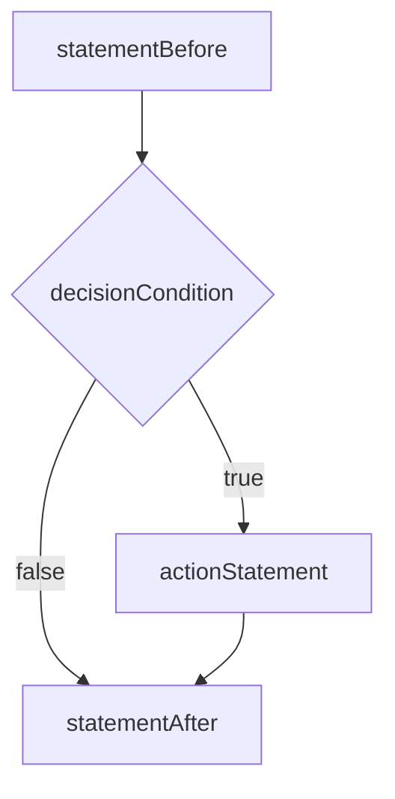

# Java Selection Structures – One-Way `if` Statement

---

## 📜 Overview

Every Java program, no matter how complex, is built from three fundamental **control structures**:

1. **Sequence** ➡️ One statement after another
    
2. **Selection** 🔀 Choose one path out of many
    
3. **Repetition** 🔁 Repeat a block of code
    

> 💡 These structures were formalized in the **Structured Program Theorem** (Böhm and Jacopini, 1966).

---

## 🧩 Sequence Structure

The most basic structure. Code executes **line-by-line** from top to bottom.

```java
public class MorningRoutine {
    public static void main(String[] args) {
        System.out.println("Get up");
        System.out.println("Eat breakfast");
        System.out.println("Go to the university");
    }
}
```

**Expected Output:**

```
Get up
Eat breakfast
Go to the university
```

> ✅ No decision-making involved. Always predictable.

---

## 🧩 Selection Structure

Java provides **three selection structures** for decision-making:

1. **One-way selection** using `if`
    
2. **Two-way selection** using `if...else`
    
3. **Multi-way selection** using `switch`
    

> 🔍 _Any complex decision-making logic can technically be replicated using just multiple one-way_ `_if_` _statements._

---

## 🧠 One-Way Selection Structure (`if` Statement)

### ✅ Syntax:

```java
if (decisionCondition)
    actionStatement;
```

### 💡 Components:

- `if`: Reserved keyword to start the conditional block
    
- `decisionCondition`: Boolean expression evaluated inside parentheses `()`
    
- `actionStatement`: Executed **only if** the condition is `true`
    

---

### 🔄 Flow Diagram:



---

## 🧪 Code Example: Uppercase Checker

### 🧾 Program:

```java
import java.util.Scanner;

public class OnewayUppercase {
    public static void main(String[] args) {
        char characterFound;
        Scanner scannedInfo = new Scanner(System.in);

        System.out.print("Input a character : ");
        characterFound = scannedInfo.next().charAt(0);

        if (characterFound >= 'A' && characterFound <= 'Z')
            System.out.println("The character found is uppercase.");

        System.out.println("Good Bye!");
    }
}
```

### 🔎 Expected Output:

**Case 1 (Input = Q):**

```
The character found is uppercase.
Good Bye!
```

**Case 2 (Input = q):**

```
Good Bye!
```

---

## 🧪 Code Example: Uppercase + Lowercase Checker

### 🧾 Program:

```java
import java.util.Scanner;

public class OnewayUpperLowercase {
    public static void main(String[] args) {
        char characterFound;
        Scanner scannedInfo = new Scanner(System.in);

        System.out.print("Input a character : ");
        characterFound = scannedInfo.next().charAt(0);

        if (characterFound >= 'A' && characterFound <= 'Z')
            System.out.println("The character found is uppercase.");

        if (characterFound >= 'a' && characterFound <= 'z')
            System.out.println("The character found is lowercase.");

        System.out.println("Good Bye!");
    }
}
```

### 🔎 Expected Outputs:

- **Input = Q**:
    

```
The character found is uppercase.
Good Bye!
```

- **Input = q**:
    

```
The character found is lowercase.
Good Bye!
```

- **Input = %**:
    

```
Good Bye!
```

---

## 🧠 Real-World Use Case: Data Validation with `if`

### 🔄 `setNumberOfShares` Method

### 📝 **Theory & Use Case**

- Ensures the **number of shares can never be negative or zero** in your code logic (e.g., a stock trading app).
    
- Good for **data validation**—stops weird bugs & data corruption!


### 🧾 Original Code:

```java
public void setNumberOfShares(int inNumberOfShares) {
    numberOfShares = inNumberOfShares;
}
```
> 📌 This code directly sets the number of shares, **without validation**. If someone inputs a negative number, it'll be accepted—which is **not logical** in most financial systems.

### ✅ Fixed Version:

```java
public void setNumberOfShares(int inNumberOfShares) {
    if (inNumberOfShares < 0)
        inNumberOfShares = 0;
    numberOfShares = inNumberOfShares;
}
```

> 📌 Ensures only non-negative values are stored.

### 🔁 **Self-Check #1**

```java
public void setNumberOfShares(int inNumberOfShares) {
    if (inNumberOfShares < 1)
        inNumberOfShares = 0;
    numberOfShares = inNumberOfShares;
}
```

> 📌 This version treats **0 and negative values** as invalid, converting them both to 0. It enforces a **minimum valid value of 1**.

---

## 🧠 Example: Validating Circular Counter Value

### ✅ Corrected Version:

In circular systems (like timers), values must stay within certain bounds.

```java
public void setCounterValue(int inCounterValue) {
    if (inCounterValue < 0 || inCounterValue >= limitValue)
        inCounterValue = 0;
    counterValue = inCounterValue;
}
```

> 📌 Valid values are from **0 (inclusive)** to **limitValue (exclusive)**. Anything outside that gets reset to 0.

### 🔁 **Self-Check #2:** Replace `>=` with another logical operator

```java
public void setCounterValue(int inCounterValue) {
    if (inCounterValue < 0 || !(inCounterValue < limitValue))
        inCounterValue = 0;
    counterValue = inCounterValue;
}
```

> 📌  `!(inCounterValue < limitValue)` is logically the same as `inCounterValue >= limitValue`. Just another way to write it.

---

## 🧱 BLOCK STATEMENTS in `if`

### 📦 Syntax:

```java
if (condition) {
    // multiple statements
    statement1;
    statement2;
    ...
    statementN;
}
```

---

## 💸 Real-Life Scenario: Bank Balance Transfer

### 🧑‍💻 Code Example 1: Bank Transfer Logic

```java
public class BankTransfer {
    public static void main(String[] args) {
        double savingsBalance = 2500.0;
        double checkingBalance = 400.0;
        final double MINIMUM_BALANCE = 500.00;
        final double TRANSFER_AMT = 1000.00;

        System.out.println("Initial Balances:");
        System.out.println("Savings: $" + savingsBalance);
        System.out.println("Checking: $" + checkingBalance);

        if (checkingBalance <= MINIMUM_BALANCE) {
            savingsBalance = savingsBalance - TRANSFER_AMT;
            checkingBalance = checkingBalance + TRANSFER_AMT;
        }

        System.out.println("\nAfter Transfer:");
        System.out.println("Savings: $" + savingsBalance);
        System.out.println("Checking: $" + checkingBalance);
    }
}
```

#### **Expected Output:**

```
Initial Balances:
Savings: $2500.0
Checking: $400.0

After Transfer:
Savings: $1500.0
Checking: $1400.0
```

> 🧾 **Explanation:** Both statements (withdrawing and depositing) only run if the balance is at or below the minimum.

```java
final double MINIMUM_BALANCE = 500.00;
final double TRANSFER_AMT = 1000.00;
double checkingBalance = 400.00;
double savingsBalance = 5000.00;

if (checkingBalance <= MINIMUM_BALANCE) {
    savingsBalance -= TRANSFER_AMT;
    checkingBalance += TRANSFER_AMT;
}
```

> If your checking account balance is too low, automatically top it up from savings.

### 🔁 **Self-Check #3:** Transfer only if balance < $300.00

```java
if (checkingBalance < 300.00) {
    savingsBalance -= TRANSFER_AMT;
    checkingBalance += TRANSFER_AMT;
}
```

> More strict threshold: only top up **if balance is below $300.00**.

---

## ❌ Common Java Errors with `if`

| ❗ Error # | Description                         | Example                  |
| --------- | ----------------------------------- | ------------------------ |
| 1       | $=$ instead of $==$ or `<`, `<=`    | `if (x = 5)` ❌           |
| 2       | Missing parentheses                 | `if x < 10` ❌            |
| 3       | Semicolon after `if`                | `if (x < 10);` ❌         |
| 4       | Misplaced statements (missing `{}`) | Only first line executes |

---

## 🧠 Self-Check Questions Recap

**Q1:** Rewrite `setNumberOfShares` method such that if number of shares < 1, set to 0 ✅

**Q2:** Replace `>=` with logically equivalent operator combination ✅

**Q3:** Can a block statement contain exactly one statement?

> ✅ Yes, but braces are **optional** in that case.

**Q4:** Modify code to transfer only if checking account balance < 300 ✅

---

## 🧭 Further Reading

- [Java `if` Statement – Oracle Docs](https://docs.oracle.com/javase/tutorial/java/nutsandbolts/if.html)
    
- [Java Selection Control Structures (GeeksforGeeks)](https://www.geeksforgeeks.org/decision-making-javaif-else-switch-break-continue-jump/)
    
- [Java Conditions and If Statements (W3Schools)](https://www.w3schools.com/java/java_conditions.asp)
    

---

### 🔥 Bonus CS Quick Quiz Time!

> 💡 **Q:** Can an `if` statement be nested inside another `if` without braces?  
> 🔥 **A:** Yes, but it's messy and confusing. Use braces `{}` always. Clean code > Clever code.

> 🧠 **Q:** What’s the difference between $=$ and $==$ in Java?  
> $=$ is for **assignment**, $==$ is for **comparison**.

---

## 🎯 Final Tip

> 🧽 _Clean logic, good indentation, and proper use of braces can prevent 90% of logic bugs in `if` statements. Keep your code readable for your future self!_

Stay tuned, Yamina! Up next? `if...else` and the legendary `switch` case! ⚔️
